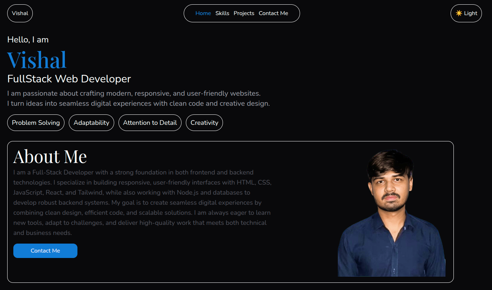

# ⚠️ In progress
# 🌐 My Portfolio Website

This is my personal portfolio website where I showcase my **projects, skills, and experience** as a web developer.  

## 🚀 Features
- Responsive design (works on all devices 📱💻)  
- Smooth animations and transitions ✨  
- Projects section with live demos and GitHub links 🔗  
- About me & contact form 📩  

## 🛠️ Tech Stack
- **Frontend:** HTML, CSS, JavaScript, React, Tailwind  
- **Animations:** GSAP / Framer Motion  
<!--- **Deployment:** Vercel / Netlify / GitHub Pages  -->

<!-- ## 📷 Preview


## 🌍 Live Demo
👉 [View Website](https://your-portfolio-link.com)  -->

## 📂 Installation
To run locally:
```bash
git clone https://github.com/vishaldewani206/portfolio
cd portfolio
npm install
npm run dev
