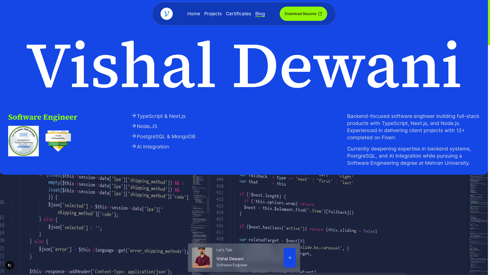

# Vishal Dewani — Portfolio Website

A modern portfolio website designed to showcase my work, technical skills, and experience as a web developer. It serves as a central hub for my professional presence, featuring selected projects, technical case studies, and a blog where I share development insights and learnings.

## Features

* Responsive design optimized for desktop, tablet, and mobile devices
* Fast performance with SEO-friendly architecture
* Project showcase with detailed case studies and live demos
* Integrated blog for technical articles, project breakdowns, and development insights
* Smooth and purposeful animations with interactive user experience
* Contact section for collaboration and professional inquiries

## Tech Stack

### Frontend

* Next.js
* React
* TypeScript
* Tailwind CSS
* shadcn/ui

### Backend

* MongoDB
* Nodemailer

### Animations & Interactions

* GSAP
* Framer Motion

### Development Tools

* Git
* GitHub

### Deployment

* Vercel

## Blog

I regularly write about web development, project architecture, UI/UX decisions, and lessons learned while building real-world applications.

Blog: https://vishaldewani.vercel.app/blog

## Preview

## Live Website

https://vishaldewani.vercel.app/

## Purpose

This portfolio represents my approach to building modern web applications with a focus on performance, usability, and clean design. It is continuously updated with new projects, experiments, and technical writing.
